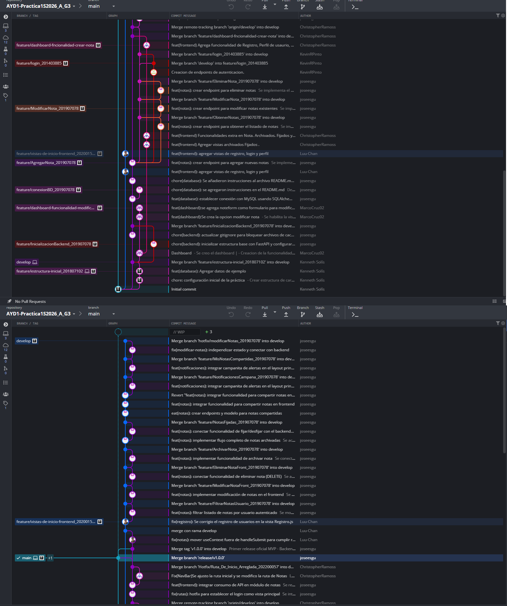

# 📓 Documentación Técnica del Proyecto: NoteCraft

## 1. Requerimientos de la Aplicación

**NoteCraft** Es un sistema desarrollado para la gestión eficiente de notas personales y apuntes. Proporciona una plataforma intuitiva que facilita la organización de la información personal de los usuarios.

### Funcionalidades Principales (Alcance)
* **Manejo de Usuarios:** Registro de perfiles de usuario, validación de login y modificación de información personal.
* **Gestión de Notas:**
    * **Agregar Nota:** Creación de notas con validación de campos obligatorios (el título no puede estar vacío). Incluye título, descripción y etiquetas.
    * **Eliminar Nota:** Remoción de notas con confirmación previa del usuario.
    * **Modificar Nota:** Edición de campos ingresados previamente, manteniendo las validaciones.
* **Organización y Prioridad:**
    * **Fijar Nota:** Opción para dar máxima prioridad a una nota, mostrándola de primero en la sección "Fijado" de la página principal.
    * **Archivar Nota:** Funcionalidad para ocultar notas de la página principal y enviarlas a una sección exclusiva de "Archivados" sin necesidad de eliminarlas.
    * **Etiquetas:** Creación de etiquetas nuevas o selección de existentes para categorizar las notas.
* **Interacción Social:**
    * **Compartir Notas:** Capacidad de compartir notas con usuarios amigos dentro de la plataforma. Genera una notificación en el dashboard del receptor e indica el nombre del propietario. Pasan a una sección de "Compartidos".

---

## 2. Metodología de Trabajo y Control de Versiones

El proyecto utiliza **Git** como sistema de control de versiones con la implementación estricta de la estrategia **GitFlow**.

### Flujo de Ramas (GitFlow)
* **Main/Master:** Entorno de producción. Solo contiene código 100% funcional. Al integrar un Release o Hotfix, se etiqueta la versión (ej. v2.0.0).
* **Develop:** Rama base de integración. Nace de Main y de ella surgen todas las ramas de nuevas funcionalidades (Features).
* **Features:** Ramas independientes para cada funcionalidad. 
    * **Nomenclatura obligatoria:** `Feature/FeatureName_#carnet` (Ej: `Feature/AgregarNota_202012345`).
    * Se fusionan a Develop al finalizar.
* **Release:** Nace de Develop para preparar una nueva versión. Se fusiona tanto a Main (creando un tag de versión) como a Develop.
* **Hotfix:** Nace de Main para corregir errores críticos en producción. Se fusiona tanto a Main (creando un nuevo tag) como a Develop.


*(El diagrama del workflow generado en GitKraken, mostrando todos los merges y acciones documentadas con el número de carnet del responsable).*
---

## 3. Tecnologías y Métodos Utilizados

El sistema está construido bajo una arquitectura Cliente-Servidor separando el Frontend y el Backend, comunicados a través de una API RESTful.

* **Frontend:** Desarrollado con librería **React** (creado con Create React App).
* **Backend:** Construido en **Python** utilizando el framework **FastAPI**.
* **Base de Datos:** **MySQL 8.x** relacional.
* **ORM:** **SQLAlchemy** para la conexión y manipulación de la base de datos desde Python.

---

## 4. 🗄️ Base de Datos – Modelo Entidad-Relación

El motor de base de datos utilizado es MySQL 8.x. El modelo soporta la gestión de usuarios, creación de notas, sistema de amistades y compartición de contenido.

### 📌 Modelo ER (Físico)

*(El diagrama representa la estructura física de la base de datos).*

### 🧱 Estructura de Tablas y Relaciones

1.  **usuarios:** `id` (PK), `usuario`, `password`.
    * *Relación:* 1 a N con `notas`, `etiquetas` y `notificaciones`. N a N con otros `usuarios` (amigos).
2.  **notas:** `id` (PK), `id_usuario` (FK), `titulo`, `descripcion`, `es_fijado`, `es_archivado`, `creado_en`, `editado_en`.
    * *Relación:* 1 a N con `notas_compartidas`. N a N con `etiquetas`.
3.  **etiquetas:** `id` (PK), `id_usuario` (FK), `nombre`.
4.  **notas_etiquetas:** `id_nota` (FK), `id_etiqueta` (FK). Tabla intermedia.
5.  **notas_compartidas:** `id_nota` (FK), `id_usuario` (FK), `id_usuario_compartido` (FK).
6.  **notificaciones:** `id` (PK), `id_usuario` (FK), `mensaje`, etc.
7.  **amigos:** `id_usuario` (FK), `id_usuario_amigo` (FK). Tabla intermedia.

---

## 5. ⚙️ Observaciones Técnicas Relevantes (Guías de Inicio)

### 🚀 5.1 Levantar la Base de Datos (MySQL)

**Opción 1: Docker (Recomendado)**
```bash
docker run --name notecraft-mysql -e MYSQL_ROOT_PASSWORD=root -e MYSQL_DATABASE=notecraft -p 3306:3306 -d mysql:8
docker exec -i notecraft-mysql mysql -u root -proot notecraft < schema.sql
```

Opción 2: Desde consola local
Dentro de la carpeta /database:

```Bash


mysql -u root -p < schema.sql
mysql -u root -p < data.sql
```

⚠️ Recomendación: No modificar el schema sin avisar al equipo. Si se cambia la estructura, actualizar el modelo ER.

### 🚀 5.2 Levantar el Backend (FastAPI)
## 📋 Prerrequisitos

* **Python 3.8+** instalado en tu sistema.
* Tener la base de datos **MySQL** local levantada o contar con las credenciales de la base de datos en la nube.

---
Ubicarse y crear el entorno virtual:
```Bash
cd backend
python -m venv venv
```

Activar el entorno virtual:
Windows: .\venv\Scripts\activate
Mac/Linux: source venv/bin/activate

Instala las dependencias, con el entorno virtual activado, instala todas las herramientas necesarias (FastAPI, el conector de MySQL, etc.) leyendo el archivo requirements.txt
```
  pip install -r requirements.txt
```
**EJEMPLO: **


Variables de entorno: Crear un archivo .env en la raíz del backend:
```Fragmento de código
DB_HOST=localhost
DB_PORT=3306
DB_USER=root
DB_PASSWORD=tu_contraseña_aqui
DB_NAME=notecraft_db
```

Ejecutar el servidor:
```Bash
uvicorn main:app --reload
```

Endpoints y Documentación: La API base corre en http://127.0.0.1:8000/. La interfaz Swagger de pruebas está en http://127.0.0.1:8000/docs. Nunca subir el archivo .env ni la carpeta venv/ a los commits.

### 🚀 5.3 Levantar el Frontend (React)
En el directorio del proyecto frontend, asegúrate de tener Node.js instalado.
Instalar dependencias:
```Bash
npm install
```

Ejecutar la aplicación en modo desarrollo:
```Bash
npm start
```

Abre http://localhost:3000 para verlo en el navegador. La página se recargará automáticamente al realizar cambios en el código. Para preparar el entorno a producción al finalizar los releases, utilizar el comando npm run build.


