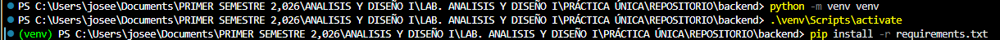

# ⚙️ NoteCraft - Backend guía de inicio

Bienvenido al backend de NoteCraft. Este servicio está construido con **Python** y el framework **FastAPI**, y se conecta a una base de datos **MySQL** utilizando **SQLAlchemy**.

Sigue estos pasos detallados para configurar y levantar el entorno de desarrollo local después de hacer *pull* de la rama `develop`.

## 📋 Prerrequisitos

* **Python 3.8+** instalado en tu sistema.
* Tener la base de datos **MySQL** local levantada o contar con las credenciales de la base de datos en la nube.

---

## 🚀 Guía de Instalación Paso a Paso

### 1. Ubícate en la carpeta del backend
Abre tu terminal (ya sea en VS Code, SourceTree o tu terminal de sistema) y navega hacia la carpeta del backend:
```
cd backend
```
### 2. crea el entorno virtual 
```
python -m venv venv
```
**(Nota: Solo necesitas ejecutar este paso la primera vez que configuras el proyecto en tu máquina).**

### 3. Activa el entorno virtual
Es **obligatorio** activar el entorno antes de instalar las dependencias o correr el servidor. Dependiendo de tu sistema operativo, el comando cambia:
 + En Windows: ```.\venv\Scripts\activate```
 + En Mac/Linux: ```source venv/bin/activate```

 Sabrás que el entorno está activo porque verás un **(venv)** al inicio de tu línea de comandos.

 ### 4. Instala las dependencias, con el entorno virtual activado, instala todas las herramientas necesarias (FastAPI, el conector de MySQL, etc.) leyendo el archivo requirements.txt
```
  pip install -r requirements.txt
```
**EJEMPLO: **

### 5. Configura las variables de entorno

Por razones de seguridad y requisito del enunciado, las contraseñas de la base de datos no se suben al repositorio.

1. Crea un archivo llamado .env en la raíz de la carpeta backend (al mismo nivel que main.py).

2. Pide al equipo las credenciales actuales de MySQL y agrégalas al archivo con este formato:

```DB_HOST=localhost
DB_PORT=3306
DB_USER=root
DB_PASSWORD=tu_contraseña_aqui
DB_NAME=notecraft_db
```

### 6. Levanta el servidor local

Para iniciar la aplicación en modo desarrollo (lo que permite que el servidor se reinicie automáticamente cada vez que guardas un cambio en el código), ejecuta:

**uvicorn main:app --reload**

### 7. Prueba la API y lee la documentación

Prueba la API y lee la documentación
Abre tu navegador web y dirígete a:

API Base: http://127.0.0.1:8000/

Documentación Interactiva (Swagger UI): http://127.0.0.1:8000/docs
(FastAPI genera esta interfaz automáticamente. Desde aquí podrás probar visualmente los endpoints para agregar, modificar y eliminar notas sin necesidad de usar Postman).


### ⚠️ NOTAS IMPORTANTES PARA EL EQUIPO

Notas Importantes para el Equipo:

Nunca subas la carpeta **venv/** ni el archivo **.env** a tus commits. Asegúrate de que tu rama respete el archivo **.gitignore** configurado.

Si instalas una nueva librería durante el desarrollo de tu feature, recuerda actualizar el archivo de requerimientos ejecutando: **pip freeze > requirements.txt.**