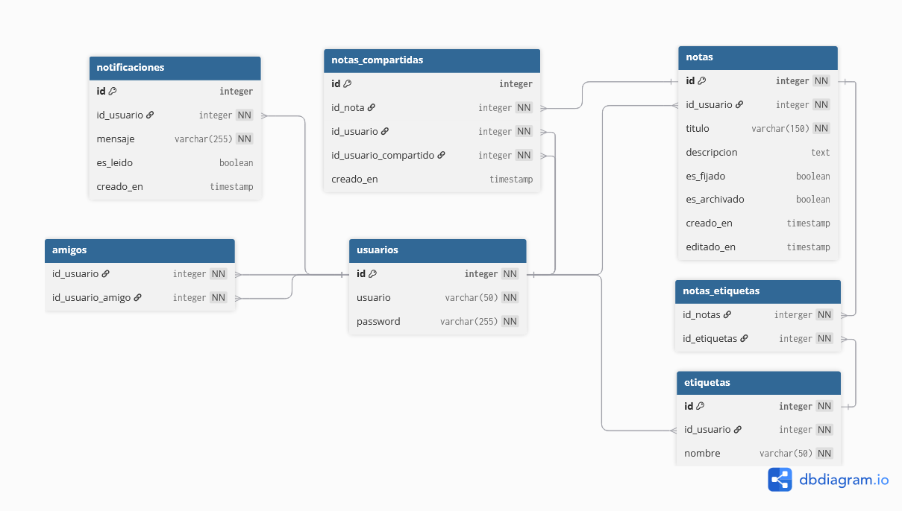
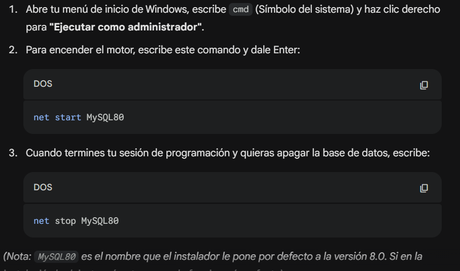

# 🗄️ Base de Datos – Notecraft

## 📌 Modelo Entidad-Relación (Modelo Físico)

> El modelo representa la estructura física de la base de datos utilizada en la práctica **Notecraft**.

---

# 📖 Descripción General

La base de datos de **Notecraft** está diseñada para soportar:

- Gestión de usuarios
- Creación de notas
- Sistema de amistades
- Compartición de notas entre usuarios

El motor de base de datos utilizado es:

MYSQL 8.x
link de descarga: https://dev.mysql.com/downloads/installer/

---

# 🧱 Estructura de Tablas

## 👤 usuarios
Almacena los usuarios del sistema.

| Campo | Tipo | Descripción |
|-------|------|------------|
| id | INT | PK |
| usuario | VARCHAR(50) | Nombre de usuario |
| password | VARCHAR(255) | Contraseña encriptada |

---

## 📝 notas
Notas creadas por los usuarios.

| Campo | Tipo | Descripción |
|-------|------|------------|
| id | INT | PK |
| id_usuario | INT | FK → usuarios(id) |
| titulo | VARCHAR(150) | Título |
| descripcion | TEXT | Contenido |
| es_fijado | BOOLEAN | Nota fijada |
| es_archivado | BOOLEAN | Nota archivada |
| creado_en | TIMESTAMP | Fecha creación |
| editado_en | TIMESTAMP | Última edición |

---

## 🏷️ etiquetas
Etiquetas personalizadas por usuario.

| Campo | Tipo | Descripción |
|-------|------|------------|
| id | INT | PK |
| id_usuario | INT | FK → usuarios(id) |
| nombre | VARCHAR(50) | Nombre etiqueta |

---

## 🔄 notas_etiquetas
Tabla intermedia para relación muchos a muchos.

| Campo | Tipo | Descripción |
|-------|------|------------
|id_nota| INT | Id de la nota |
|id_etiqueta| INT | Id de la etiqueta |

---

## 📤 notas_compartidas
Registra notas compartidas entre usuarios.

| Campo | Tipo | Descripción |
|-------|------|------------|
| id_nota | INT |FK → notas(id) |
| id_usuario | INT | Usuario que comparte |
| id_usuario_compartido | INT | Usuario que recibe |

---

## 🔔 notificaciones
Notificaciones de los usuarios.

| Campo | Tipo | Descripción |
|-------|------|------------|
| id_usuario | INT | FK → usuarios(id) |

---

## 🤝 amigos
Relación muchos a muchos entre usuarios.

| Campo | Tipo | Descripción |
|-------|------|------------|
| id_usuario | INT | id del usuario |
| id_usuario_amigo | INT | id del usuario amigo |

---

# 🔗 Relaciones del Modelo

### 1️⃣ usuarios → notas
- Tipo: 1 a N
- Un usuario puede tener muchas notas.
- ON DELETE CASCADE

---

### 2️⃣ usuarios → etiquetas
- Tipo: 1 a N
- Cada usuario tiene sus propias etiquetas.

---

### 3️⃣ notas ↔ etiquetas
- Tipo: N a N
- Resuelta mediante tabla `notas_etiquetas`.

---

### 4️⃣ usuarios ↔ usuarios (amigos)
- Tipo: N a N
- Resuelta mediante tabla `amigos`.

---

### 5️⃣ notas → notas_compartidas
- Tipo: 1 a N
- Una nota puede compartirse con múltiples usuarios.

---

### 6️⃣ usuarios → notificaciones
- Tipo: 1 a N

---

# 🚀 Cómo levantar la base de datos

## 🔹 Opción 1 – Usando MySQL desde consola

### 1️⃣ Verificar instalación

bash

Desde la carpeta /database

mysql -u root -p < schema.sql

Ejecutar el data (datos de prueba)

mysql -u root -p < data.sql

--- 
## 🔹 Opción 2 – Usando MySQL Workbench

1. Abrir MySQL Workbench

2. Conectarse al servidor local

3. Ir a: File > Open SQL Script

4. Abrir schema.sql

5. Presionar el botón ⚡ (Execute)

6. Repetir el proceso con data.sql

--- 
## 🔹 Opción 3 – Usando Docker

docker run --name notecraft-mysql \
-e MYSQL_ROOT_PASSWORD=root \
-e MYSQL_DATABASE=notecraft \
-p 3306:3306 \
-d mysql:8

Ejecutar: docker exec -i notecraft-mysql mysql -u root -proot notecraft < schema.sql

## Ejecutar motor de MYSQL (server)

⚠️ Recomendaciones

Usar MySQL 8.x

No modificar el schema sin avisar al equipo

Si cambian la estructura, actualizar el modelo ER